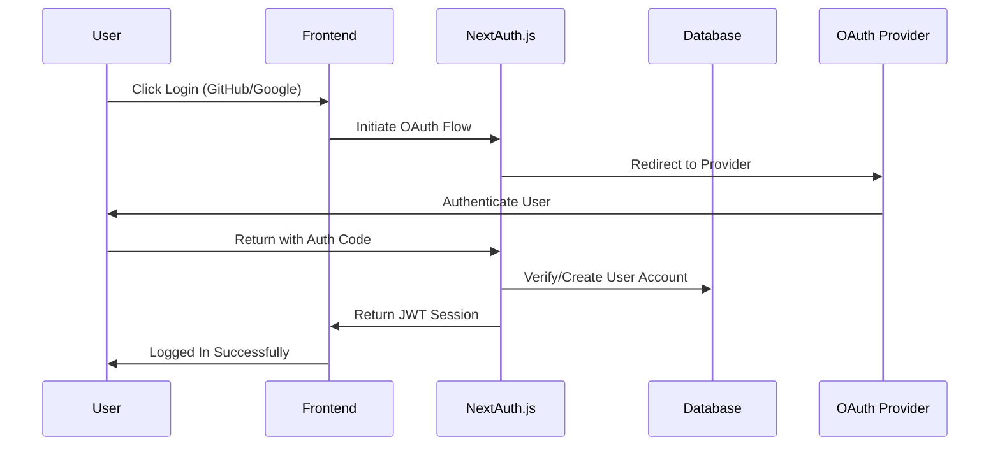

# Preliminary Design Review (PDR) - DevQnA Platform

## 📋 Document Information

- **Document Version**: 1.0
- **Review Date**: October 2025
- **Prepared by**: Development Team
- **Project**: DevQnA - Developer Q&A Platform
- **Status**: ✅ Approved

---

## 🎯 Executive Summary

DevQnA is a modern, full-stack Q&A platform designed for developers, built as an enhanced alternative to Stack Overflow. This PDR outlines the preliminary design decisions, architecture choices, and technical specifications for the platform.

## 🏗️ System Architecture

### High-Level Architecture

```
┌─────────────────┐    ┌─────────────────┐    ┌─────────────────┐
│   Next.js       │    │   MongoDB       │    │  External APIs  │
│   Frontend      │◄──►│   Database      │    │  (OAuth, Jobs)  │
│                 │    │                 │    │                 │
│ • React 19      │    │ • Mongoose ODM  │    │ • GitHub OAuth  │
│ • TypeScript 5  │    │ • 10+ Models    │    │ • Google OAuth  │
│ • Tailwind CSS  │    │ • Optimized     │    │ • Job Search    │
└─────────────────┘    └─────────────────┘    └─────────────────┘
```

### Technology Stack Justification

| Component | Technology     | Reason                       |
| --------- | -------------- | ---------------------------- |
| Frontend  | Next.js 15     | App Router, SSR, Performance |
| Language  | TypeScript 5   | Type Safety, Better DX       |
| Styling   | Tailwind CSS 4 | Utility-first, Responsive    |
| Database  | MongoDB        | Flexible Schema, Scalable    |
| Auth      | NextAuth.js    | Secure, Multiple Providers   |
| UI Lib    | Radix UI       | Accessible, Customizable     |

## 🗄️ Database Design

### Core Entities

#### 1. User Management

```javascript
User: {
  _id: ObjectId,
  name: String,
  username: String,
  email: String,
  image: String,
  reputation: Number,
  badge: String,
  joinedAt: Date,
  preferences: Object,
  skills: [String],
  socialLinks: Object
}
```

#### 2. Content Management

```javascript
Question: {
  _id: ObjectId,
  title: String,
  content: String,
  author: ObjectId (ref: User),
  tags: [ObjectId] (ref: Tag),
  views: Number,
  upvotes: Number,
  downvotes: Number,
  answers: Number,
  isResolved: Boolean,
  acceptedAnswer: ObjectId (ref: Answer)
}

Answer: {
  _id: ObjectId,
  content: String,
  question: ObjectId (ref: Question),
  author: ObjectId (ref: User),
  upvotes: Number,
  downvotes: Number,
  isAccepted: Boolean
}
```

#### 3. Social Features

```javascript
Vote: {
  _id: ObjectId,
  user: ObjectId (ref: User),
  targetType: String, // 'question' | 'answer'
  targetId: ObjectId,
  voteType: String // 'upvote' | 'downvote'
}

Collection: {
  _id: ObjectId,
  name: String,
  description: String,
  user: ObjectId (ref: User),
  questions: [ObjectId] (ref: Question),
  isPublic: Boolean,
  tags: [ObjectId] (ref: Tag)
}
```

### Data Relationships

- **One-to-Many**: User → Questions, User → Answers, User → Collections
- **Many-to-Many**: Questions ↔ Tags, Users ↔ Badges
- **Polymorphic**: Votes can target Questions or Answers
- **Self-Referential**: Tags can have related tags

## 🔐 Security Architecture

### Authentication Flow



### Security Measures

- **Password Hashing**: bcryptjs with salt rounds
- **Session Management**: Secure JWT tokens with expiration
- **Input Validation**: Zod schemas for all form data
- **Rate Limiting**: API endpoint protection
- **CORS Configuration**: Proper cross-origin policies

## 🚀 API Design

### RESTful Endpoints Structure

```
API Routes:
├── /api/auth/*           # Authentication endpoints
├── /api/questions/*      # Q&A management
├── /api/users/*          # User profile management
├── /api/tags/*           # Tag management
├── /api/votes/*          # Voting system
├── /api/collections/*    # Collection management
├── /api/jobs/*           # Job board integration
└── /api/ai/*             # AI-powered features
```

### API Response Format

```typescript
interface APIResponse<T> {
  success: boolean;
  data?: T;
  error?: {
    message: string;
    code: string;
    details?: any;
  };
  meta?: {
    timestamp: string;
    version: string;
    pagination?: {
      page: number;
      limit: number;
      total: number;
      totalPages: number;
    };
  };
}
```

## 🎨 User Interface Design

### Design System

- **Color Palette**: Dark/Light theme support
- **Typography**: Inter + Space Grotesk font combination
- **Components**: Radix UI primitives with custom styling
- **Icons**: Lucide React icon library
- **Responsive**: Mobile-first design approach

### Key UI Components

1. **Navigation**: Left sidebar + top navbar
2. **Card Layouts**: Question, Answer, User, Job cards
3. **Forms**: Rich text editor with markdown support
4. **Search**: Global and local search functionality
5. **Filters**: Multi-criteria filtering system

## 📊 Performance Considerations

### Optimization Strategies

- **Code Splitting**: Route-based automatic splitting
- **Image Optimization**: Next.js built-in optimization
- **Database Indexing**: Optimized queries with proper indexes
- **Caching**: Strategic caching for better performance
- **Bundle Analysis**: Regular bundle size monitoring

### Performance Metrics Targets

- **First Contentful Paint**: < 1.5s
- **Largest Contentful Paint**: < 2.5s
- **Cumulative Layout Shift**: < 0.1
- **Time to Interactive**: < 3.5s
- **Bundle Size**: < 500KB (gzipped)

## 🔧 Development Environment

### Tooling Setup

- **Linting**: ESLint with Next.js and TypeScript rules
- **Formatting**: Prettier with consistent configuration
- **Type Checking**: Strict TypeScript configuration
- **Testing**: Jest and React Testing Library setup
- **Git Hooks**: Pre-commit quality checks

### Development Workflow

1. **Feature Branching**: Git flow with feature branches
2. **Code Review**: Pull request reviews required
3. **CI/CD**: Automated testing and deployment
4. **Documentation**: Living documentation updates

## ⚠️ Risk Assessment

### Technical Risks

| Risk                     | Probability | Impact | Mitigation                          |
| ------------------------ | ----------- | ------ | ----------------------------------- |
| MongoDB Performance      | Medium      | High   | Proper indexing, query optimization |
| OAuth Integration Issues | Low         | Medium | Comprehensive testing, fallbacks    |
| Bundle Size Growth       | Medium      | Medium | Code splitting, tree shaking        |
| Third-party API Limits   | High        | Medium | Caching, rate limiting, monitoring  |

### Business Risks

| Risk              | Probability | Impact | Mitigation                         |
| ----------------- | ----------- | ------ | ---------------------------------- |
| User Adoption     | Medium      | High   | Marketing, community building      |
| Content Quality   | Medium      | High   | Moderation, reputation system      |
| Competition       | High        | Medium | Unique features, better UX         |
| Scalability Costs | Medium      | Medium | Efficient code, cloud optimization |

## 📋 Implementation Plan

### Phase 1: MVP (✅ Completed)

- [x] User authentication system
- [x] Basic Q&A functionality
- [x] Tag-based organization
- [x] Voting system
- [x] Responsive design

### Phase 2: Enhancement (Current)

- [x] Rich text editor
- [x] Advanced search
- [x] Collections feature
- [x] Job board integration
- [x] Enhanced UI/UX

### Phase 3: Advanced Features (Next)

- [ ] Real-time chat
- [ ] Code playground
- [ ] Advanced analytics
- [ ] Mobile application
- [ ] API documentation

## ✅ Approval Checklist

### Technical Requirements

- [x] Architecture reviewed and approved
- [x] Database schema validated
- [x] Security measures implemented
- [x] Performance targets defined
- [x] API design completed

### Business Requirements

- [x] Feature set meets requirements
- [x] User experience considered
- [x] Scalability planned
- [x] Risk mitigation strategies
- [x] Documentation completed

## 📞 Contact Information

- **Technical Lead**: Development Team
- **Product Owner**: Product Team
- **Review Board**: Architecture Committee

---

**PDR Status**: ✅ **APPROVED**

This Preliminary Design Review establishes the foundation for the DevQnA platform development. All stakeholders have reviewed and approved the proposed architecture, technology stack, and implementation approach.
